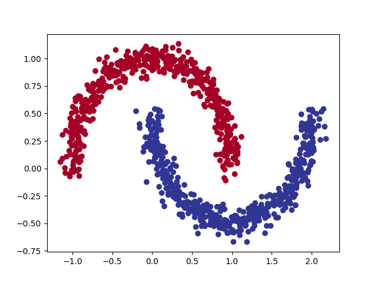
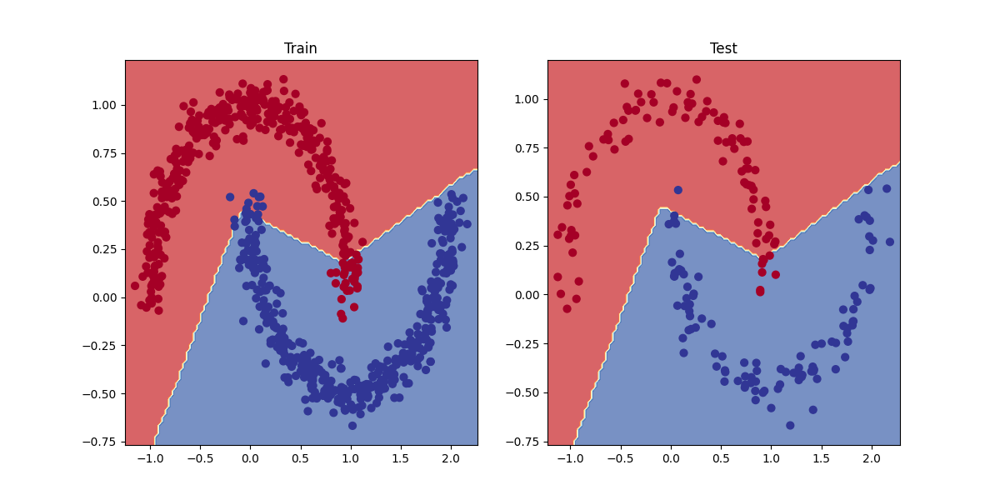

## **Project Description**

This project demonstrates how to build and train a neural network for binary classification using PyTorch and Scikit-Learn's make_moons dataset. The dataset consists of two interleaving moon-shaped clusters, making it ideal for testing non-linear classification models.
## **Technologies Used**

- **Python**:       The primary programming language for building the application.
- **Scikit-learn**: Used to generate the synthetic make_moons dataset and split data into training and testing sets.
- **Pytorch**:    Provides the deep learning framework to build, train, and evaluate the neural network model.
- **Torchmetrics**: Used to calculate accuracy and evaluate model performance in a structured way.
- **Matplotlib**: Utilized for visualizing data distribution and plotting the decision boundary of the trained model.

## **Features**

### **Dataset Generation**
- Uses Scikit-Learn's `make_moons()` to generate a synthetic dataset with **1000 samples** and a small amount of noise.
- Data is converted into **PyTorch tensors** and split into **training (80%) and testing (20%)** sets.

### **Neural Network Model**
- A **fully connected feedforward neural network** built using `torch.nn.Module`.
- **Three-layer architecture** with **ReLU activation** for non-linearity.
- The final layer outputs **logits** for binary classification.

### **Training and Optimization**
- Uses **Binary Cross Entropy with Logits Loss (BCEWithLogitsLoss)** for classification.
- **Stochastic Gradient Descent (SGD)** as the optimizer.
- Trained for **1000 epochs** with accuracy tracking.

### **Evaluation and Visualization**
- Model performance is evaluated using **accuracy and loss metrics**.
- A **decision boundary plot** is generated to visualize the classifier's performance.

## **Installation Instructions**

To run the project, you’ll need to install the following dependencies. You can set up your environment and install the required packages using the `requirements.txt` file.

### 1. Set up your virtual environment (optional but recommended):

```bash
python -m venv venv
```

### 2. Activate the virtual environment:

- On **Windows**:
```bash
venv\Scripts\activate
```

- On **macOS/Linux**:
```bash
source venv/bin/activate
```
### 3. Install the dependencies:
Once the virtual environment is activated, run the following command to install all the required packages:
```bash
pip install -r requirements.txt
```

### 4. Run main.py:
Once the dependencies has been installed in step3,
```bash
python3 main.py
```
Raw data (moon dataset):



Binary classification:




